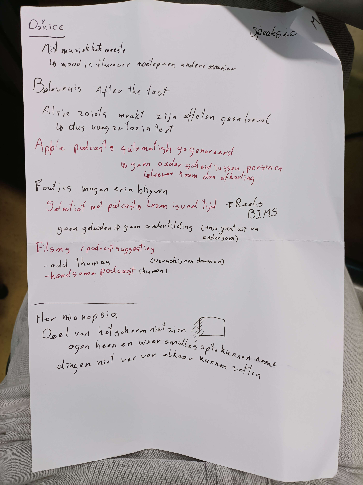

# HCD
<h1> A Deaf Womans Music </h1>
<h2>week 1</h2>

fotos van de notities die ik het eerste gesprek met darice heb gemaakt, en het gesprek met Mieke vooraf meer in het algemeen

Ik heb besloten om me te gaan richten op het visualiseren van de muziek, omdat dat het ding is wat het meest gemist word. (Ook gedeeltelijk doordat ik denk dat iedereen met ondertiteling gaat werken) Ik vind het leuk om met het idee van een geluidsgrafiek (stenograph?/ heartbeatmonitor) te werken, omdat darice het misschien ook kan relateren aan geluidstrillingen die ze misschien kan voelen.

Feedback vasilis: Je hoeft niet perse een stenograph te maken, het kan ook gewoon een dingetje zijn wat op en neer gaat -> Ik ben na deze feedback gaan experimenteren met verschillende manieren van geluid, niet alleen op en neer maar ook in en uitzoemen, draaien en diktes van lijnen

<h2>week 2</h2>

feedback van mieke: zorg dat het beeld 1 geheel word

feedback vasilis: 
vershillende versies met vershillende soorden muziek
kijk even naar de doorgestuurde code voor hulp met timestamps

<h3> gekregen feedback test 2</h3>

de tests van deze week:

<a href="https://codepen.io/IKreike/pen/dPyazXE">Verschillende soorten muziek- test</a>
<a href="https://codepen.io/IKreike/pen/XJWwojN"> test gebaseert op muziek</a>

// specifieke elementen van de muziek of alleen de vibe~
// vibe is belangrijker
// weten welk instrument welk onderdeel is?
// Als dat belangrijk is, kun je misschien hetzelfde doen zoals er met de blaffende honden gedaan werd, namelijk een hond(instrument) laten zien.

// kleuren met bepaalde elementen
// zelf niet een bepaalde kleurcode voor instrumenten

// is het belangrijk om het ritme want de muziek mee te krijgen? // mis je dat? is het mismatched
// de vibe is belangrijker

// notities
// gebruik text als begeleiding en context voor de muziek
// evt als aanduideing voor verschillende elementen

// alles ziet eruit als bas(ieder geval als je geen context geeft) 

// versterk het kleurgebruik

// denk na over de locatie van het geheel- ten opzichte van de film
// als je het scherm gaat bewegen moet het subtiel/ (gesproken)text niet bewegen, tenzij het alleen een toon/ geluid is

// tips voor anderen (die miss ook leuk zijn voor mij)
// comic like sounds (look at the first batman)
// fonts: sans-sariv heeft voorkeur 

<h3>Conclusie testen: </h3>
<ol>
<li> zet er algemene tekst bij voor de beschrijving van de muziek</li>
<li> Als de specifieke instrumenten belangrijk zijn kun je misschien een beschrijving of plaatje van het instrument erbij zetten</li>
<li> De vibe van de muziek is belangrijker dan het ritme</li>
<li> Als je niks erbij zet ziet alles er eruit als een bas omdat dat een heel bekend instrument is</li>
<li> sans- serif is een beter(fijner) font</li>
</ol>s

Ik heb uiteindelijk niet besloten om nog niet in de code van vasilis te duiken omdat het me een hele klus leek voor relatief weinig opbrengst. Ik kan wel bijvoorbeeld met autoplay wat proberen te fixen, zodat het alsnog op de goede timing loopt

<h2>week 3</h2>

De vershillende tests van deze week. De feedback staat ook in het javascript gedeelte

<a href="https://codepen.io/IKreike/pen/raaNOdK"> base test</a>

roze tekst niet te lezen

<a href="https://codepen.io/IKreike/pen/yyyLYjp"> music in the background</a>

// grootte is goed // text leesbaar // timing met film - //tekst in het midden

<a href="https://codepen.io/IKreike/pen/azzbvaX?editors=1100">links gepositioneerd</a>

maakt 1 geheel als het op de achtergrond staat(vorige was beter)

<a href="https://codepen.io/IKreike/pen/yyyLYQK"> grote text en music area</a>

 grootte is prima, kleur nog niet

<a href="https://codepen.io/IKreike/pen/oggNjVv"> test met een andere kleur</a>

// kleuren zijn beter leesbaar // minder belangrijk voor intonatie van de muziek

<a href="https://codepen.io/IKreike/pen/YPPzymy"> tekst en icons</a>

 // leuk idee dat dit ook kan

<a href="https://codepen.io/IKreike/pen/emmYpqQ?editors=1100">test met icoontjes ipv text</a>

 // ook leuk // kleuren?? contrast icoon met achtergrond // de text bij de iconen word niet gemist

<h3>Conclusie testen: </h3>
<ol>
<li> muziek op de achtergrond werkt het beste omdat het dan 1 is met de film</li>
<li> De specifieke kleuren maken niet uit als ze maar genoeg contrast hebben</li>
<li> Icoontjes zijn niet storend en er word geen informatie gemist als je de tekst vervangt</li>
<li> beschrijvingstekst in het midden</li>
</ol>

feedback van vasilis: vergeet niet te testen, ook in de laatste iteratie. 

plannen voor deze week: langer fragment, verschillende onderdelen aan elkaar maken 

<h2>week 4</h2>

De test van deze week:

<a href="https://codepen.io/IKreike/pen/qEEqXBd?editors=0010"> Link naar de week 4 test</a>

Ik heb voor de test deze week de verschillende tests en ideeën uit eerdere weken verwerkt in een langere clip. Dit heb ik gedaan om een beter beeld te krijgen over hoe een hele film eruit zou kunnen zien met deze effecten, maar ook om de verschillende effecten te kunnen laten zien.

<h3>Keuzes en veranderingen</h3>
<ol>
<li>Ik heb felle kleuren gekozen voor het instrumentele gedeelte voor een goed contrast met de icoontjes en uit eerdere feedbacksessies was uitgekomen dat de kleur per instrument niet bepalend was voor het gevoel erbij</li>
<li>Ik heb extra tijd besteed aan het controleren van de timing van de animaties zodat hetzelfde snelle en verwarrende gevoel wat gehoord word ook mee word gegeven in beeld.</li>
<li>De animaties zijn zeer kleurrijk, ikzelf vind het passend omdat het geluid ook is in sterk contrast is tegen de spanning opbouwende sfeer die hier hangt (waardoor het juist versterkt). Het is handig om te testen of dit ook overkomt met het beeld</li>
</ol>
<h3>Feedback testen: (met mieke)</h3>

 // voelt heel snel aan (klopt als dat ook in het echt zo is)

// caption ver onderaan- later duidelijk wat het is
// interressante combinatie 

// interressante overweging -. belangrijk verschil geluid en gezegde bv: met haken[] voor geluid

// geeft goed het gevoel bvan de scene mee- nieuwe interressante manier

// let op het contrast als je de tekst naar boven verplaatst

<h3>Conclusies testen: </h3>
<ol>
<li>Het duurt even voordat er begrip is voor wat de animaties zijn, mede doordat de ondertiteling zeer laag staat. Het is handiger om deze direct(er) onder de video zelf te zetten. (na vraag over verwarring muziektext en gesproken text:) Als je de muziek in haakjes zet zal dat probleem minder/ niet zijn. Zorg als je dit doet wel nog steeds voor een goed contrast met de text</li>
<li>Leuke manier om dit te doen, is nieuw en interressant. </li>
</ol>

<h2>Eindconclusie </h2>

wat ik nog zou doen als ik extra tijd had:

<ul>
<li>Ondertiteling toevoegen om de combinatie met tekst en de animaties te kunnen testen, en het geheel functioneler te maken.</li>
<li>De setup van Vasilis integreren zodat het je door kan spoelen en de animaties op pauze kan zetten en de animaties daar rekening mee houden.</li>
<li>Experimenteren met een andere sfeer muziek, en kijken of dat ook goed overkomt. </li>
</ul>

<h3> bronnen:</h3>
<a href="https://studentmusicorganizer.com/blogs/main/14032261-the-colours-of-music#:~:text=PINK%20for%20forte%20(loud)%20and,colour%20for%20a%20quiet%20sound."> heb een bron gezocht over kleurgebruik in de muziek</a>

<a href="https://stackoverflow.com/questions/26986129/play-multiple-css-animations-at-the-same-time"> Stacking animations</a>
<a href="https://webaim.org/resources/contrastchecker/">Contrast checker</a>
<a href="https://www.nemokennislink.nl/publicaties/synesthesie-kleuren-horen-klanken-zien/">Over hoe kleuren en geluiden gerelateerd zijn</a>

En de grootste bron is natuurlijk Darice(en Mieke natuurlijk)

